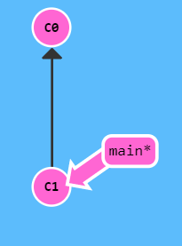
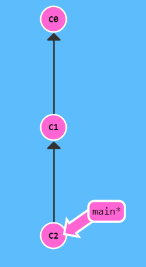
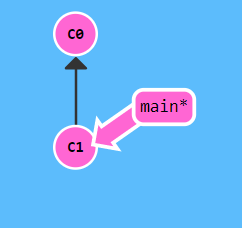
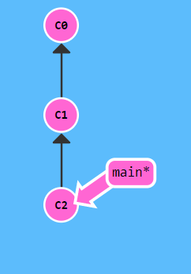
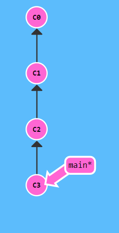

<!--  -->

<!--   https://learngitbranching.js.org  -->

    

# Comandos de Git
Tienes una gran variedad de comandos de git en este sandbox. Estos incluyen:

commit
branch
checkout
cherry-pick
reset
revert
rebase
merge

¡Comparte!
Comparte tus árboles con tus amigos usando export tree e import tree

¿Tienes una buena lección que compartir? Prueba construyendo un nivel con build level o prueba el nivel de un amigo con import level

Para ver todos los comandos disponibles, escribe show commands. Hay algunas joyitas como undo y reset

Por ahora, empecemos con los levels...

Secuencia introductoria
Una breve introducción a la mayoría de los comandos de git

1: Introducción a los commits de Git

# Commits de Git
Un commit en un repositorio git registra un snapshot de todos los archivos en tu directorio. Es como un gran copy&paste, ¡pero incluso mejor!

Git pretende mantener los commits tan livianos como sea posible, por lo que no copia ciegamente el directorio completo cada vez que haces un commit. Puede (cuando es posible) comprimir un commit como un conjunto de cambios (o un "delta") entre una versión de tu repositorio y la siguiente.

Git mantiene, también, un historial de qué commits se hicieron y cuándo. Es por eso que la mayoría de los commits tienen commits ancestros encima -- designamos esto con flechas en nuestra visualización. ¡Mantener el historial es genial para todos los que trabajan en el proyecto!

Hay un montón en lo que ahondar, pero por ahora puedes pensar en los commits como snapshots de tu proyecto. Los commits son muy livianos, y ¡cambiar de uno a otro es terriblemente rápido!

Veamos cómo se ve esto en la práctica. A la derecha tenemos una visualización de un (pequeño) repositorio git. Hay dos commits: el commit inicial, C0, y un commit que lo sigue, C1, que podría tener algunos cambios interesantes.

Dale al botón de abajo para crear un nuevo commit.

    $ git commit -m "Missatge del commit!"

 

¡Allá va! Increíble. Acabamos de hacer cambios al repositorio y los guardamos como un commit. El commit que acabamos de crear tiene un padre, C1, que referencia al commit en el que se basó este.

¡Venga, inténtalo ahora! Crea **dos commits** para completar el nivel.

    $ git commit -m "Primer (C1) commit!"

    $ git commit -m "Primer commit!"

